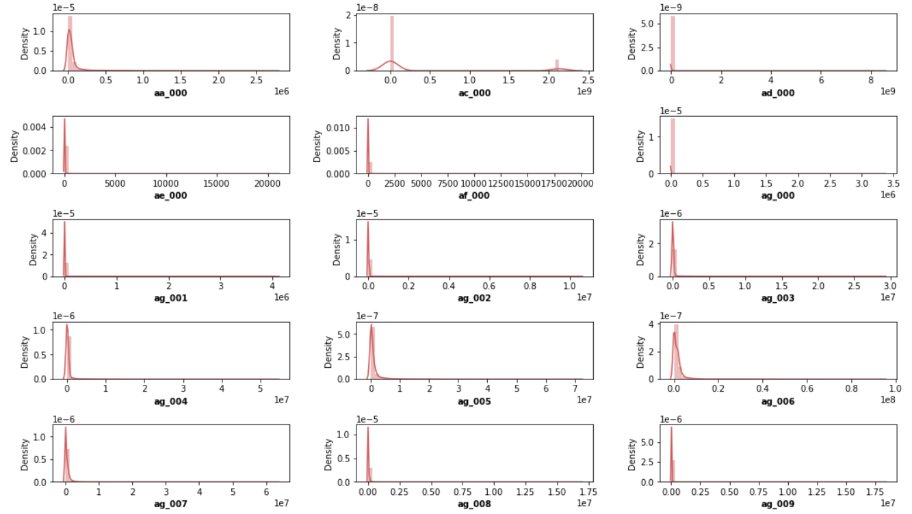

### 1.0 Sensor Fault Detection in Scania Trucks

This project is focused on detecting potential sensor failures in Scania trucks using machine learning. It processes sensor data to predict whether a truck is experiencing a fault or operating normally. The pipeline covers data ingestion, transformation, model training, and prediction — all structured with production-ready modularity and a Flask-based API for live inference.


### 2.0 Problem Statement

Scania trucks are equipped with advanced sensors to monitor various vehicle functions. Failures in these sensors can lead to incorrect diagnostics, unnecessary maintenance, or even vehicle breakdowns.
Manually identifying such faults from raw sensor data is challenging due to the complexity and volume of the data.

This project aims to build a robust machine learning pipeline that can:

* Automatically detect whether a truck is operating normally or experiencing a sensor fault.
* Assist in predictive maintenance and minimize operational downtime.
* Provide real-time predictions through a user-friendly web interface.

📓 **Notebook**: [Scania APS Failure Prediction - EDA + Training](https://github.com/NITIN9181/Sensor-Fault-Detection-Scania/blob/main/notebook/Scania_APS_failure_prediction.ipynb)


### 3.0 Tech Stack Used
| Technology           | Badge                                                                                                                      |
| -------------------- | -------------------------------------------------------------------------------------------------------------------------- |
| **Python**           |                     |
| **Flask**            |                        |
| **Pandas**           |                     |
| **NumPy**            |                        |
| **Scikit-learn**     |  |
| **Matplotlib**       |         |
| **Joblib**           |                      |
| **Jupyter Notebook** |                  |
| **VS Code**          |          |
| **GitHub**           |                        |


### 4.0 📊 Data Description

The dataset used in this project is sourced from the **Scania APS (Air Pressure System) Failure Prediction** dataset. It contains sensor readings from trucks, aimed at identifying potential component failures.

####  Key Points:

* The target variable is **`class`**, where:

  * `neg` → No failure
  * `pos` → Failure
* The dataset includes **60+ anonymized sensor features**
* Missing values are represented as `'na'`

#### 📁 Files:

| File                           | Description                                       |
| ------------------------------ | ------------------------------------------------- |
| `aps_failure_training_set.csv` | Training dataset with labeled classes             |
| `aps_failure_test_set.csv`     | Test dataset with unlabeled class for evaluation  |
| `train.csv` / `test.csv`       | Processed & cleaned versions used in this project |

#### 🧮 Feature Types:

* All features are **numerical** (except the `class` label)
* Features are **standardized** and **imputed** using mean strategy


### 5.0 🧠 Business Assumptions

To build an effective APS failure prediction system, the following assumptions are considered from a **real-world fleet maintenance** perspective:

#### 1️⃣ Preventive Maintenance Value

If a truck is **predicted to fail**, it will be sent for inspection **before** actual failure occurs — minimizing unexpected breakdowns, tow costs, and delivery delays.

#### 2️⃣ Imbalanced Impact

* **Positive cases (`pos`)** are rare but **very costly**.
* Hence, the system should prioritize **high recall** for failure detection (even if it means more false positives).

#### 3️⃣ Sensor Data is Reliable

* Sensor data is assumed to be logged correctly with minimal noise or corruption.
* Missing values (`na`) are handled but considered **non-critical** if properly imputed.

#### 4️⃣ Real-time Deployment

* The trained model will be deployed via a **Flask-based web app**.
* Truck data can be uploaded in CSV form, and **instant predictions** will be generated for operational teams.

#### 5️⃣ Business Success Metric

* **Model performance (F1-score, Recall)** on positive class is crucial.
* Long-term goal: reduce APS-related breakdowns by **at least 30%** after adoption.

### 6.0 🧱 Product Structure

Thanks for pointing that out! Let's revisit **Section 6.0 – Product Structure** of your README to **accurately reflect your GitHub repo layout**, as per the screenshots and [your repo link](https://github.com/NITIN9181/Sensor-Fault-Detection-Scania).

---

### ✅ **6.0 Product Structure (Updated)**

```bash
Sensor-Fault-Detection-Scania/
├── artifacts/                  # Stores model.pkl, preprocessor.pkl after training
├── flask_app/
│   ├── static/                 # CSS, images, etc.
│   ├── templates/              # HTML templates (index.html)
│   ├── app.py                  # Main Flask application
│   └── utils.py                # Utility functions for prediction
├── notebook/                   
│   └── Scania_APS_failure_prediction.ipynb  # Exploratory Data Analysis
├── pipeline/
│   ├── __init__.py
│   └── predict_pipeline.py     # Class-based prediction logic
├── src/
│   ├── components/
│   │   ├── data_ingestion.py
│   │   ├── data_transformation.py
│   │   └── model_trainer.py
│   ├── exception.py
│   ├── logger.py
│   └── utils.py
├── .gitignore
├── app.py                      # (optional) wrapper if used outside flask_app
├── config.yaml
├── main.py                     # Pipeline training entry point
├── README.md
├── requirements.txt
└── setup.py
```

### 💡 Notes:

* `flask_app/app.py` is the web app entry point.
* `pipeline/predict_pipeline.py` handles prediction from DataFrame.
* `src/components` has modularized code for ingestion, transformation, training.
* `artifacts` is generated during training.
* `notebook/` holds the Jupyter Notebook for EDA and insights.

---

Let me know if you want to visually represent this with icons or add links to specific files in the repo!


### 7.0 🧠 Solution Strategy

The end-to-end pipeline for Scania Truck Component Failure Prediction is structured as follows:

#### 🔹 Step 1: Data Ingestion

* Raw training and testing datasets are read from local files.
* Files are stored and tracked via the `artifacts/` folder for reproducibility.

#### 🔹 Step 2: Data Transformation

* All input features are numerical.
* Missing values (`'na'`) are imputed using **mean strategy**.
* Features are scaled using **StandardScaler** for optimal model performance.
* A preprocessor object (pipeline) is saved using `joblib`.

#### 🔹 Step 3: Model Training

* A **Random Forest Classifier** is trained to distinguish between **positive (failure)** and **negative (no failure)** component failures.
* Model evaluation metrics include:

  * ✅ Accuracy
  * ✅ Precision
  * ✅ Recall
  * ✅ F1 Score
* The trained model is serialized and saved as `model.pkl`.

#### 🔹 Step 4: Prediction Pipeline

* The prediction pipeline loads the preprocessor and trained model.
* Transforms new data and predicts failure labels in real-time.

#### 🔹 Step 5: Flask API + Web UI

* A lightweight **Flask API** handles CSV uploads and returns predictions via JSON or a web interface.
* The app is accessible via a simple form-based UI with file upload support.
* Integrated with Matplotlib to display pie chart results of predictions.


### 8.0 📊 Top Data Insights

#### 🔸 Target Class Imbalance


As highlighted above, the image shows the imbalance of the dependent variable (`class`). There are significantly more negative samples (non-faulty) compared to positive samples (faulty), which justifies the use of precision/recall/F1-score over accuracy for evaluating model performance.


#### 🔸 Missing Values Visualization


The image above shows the percentage of missing values for each sensor in the dataset. This insight helps guide our preprocessing strategy—specifically the use of imputation techniques to handle the 'na' values in the dataset.


#### 🔸 Sensor Data Distribution



The image above shows the data distribution for the first few sensor readings. Interestingly, for almost all sensors, the data appears normally distributed and mostly lies within a similar range. This uniformity justifies the use of StandardScaler during preprocessing.


### **9.0 Machine Learning Applied**

Several machine learning models and imputation strategies were evaluated to find the most effective way to detect sensor faults in Scania trucks. The primary metric considered was **Total Cost**, which reflects the severity and expense of misclassifying faulty and non-faulty components.

| **Model**              | **Imputation Method**          | **Total Cost** |
| ---------------------- | ------------------------------ | -------------- |
| XGBClassifier          | Simple Imputer - Constant      | **2950**       |
| XGBClassifier          | MICE (Multivariate Imputation) | 3510           |
| XGBClassifier          | KNN Imputer                    | 4460           |
| XGBClassifier          | Simple Imputer - Mean          | 4950           |
| CatBoostClassifier     | Median                         | 5760           |
| RandomForestClassifier | PCA-Based Feature Reduction    | 34150          |

> 💡 The **XGBClassifier** with **Simple Constant Imputation** achieved the **lowest cost**, indicating its superior ability to minimize false positives and false negatives in this high-stakes classification task.


### **10.0 Final Result**

**Final Model:**
After extensive experimentation and evaluation, the best-performing model is:

* **Model**: `XGBoost Classifier`
* **Imputation Method**: `Simple Imputer (Constant Strategy)`
* **Final Accuracy**: `99.6%`
* **Total Cost**: `2950`


### **Flask Web App**

A lightweight **Flask-based web application** has been developed to allow users to upload CSV files and receive predictions on potential sensor faults.

📸 **Flask UI Snapshot:**


🧠 The backend pipeline handles:

* Preprocessing the input using a saved transformer
* Feeding the transformed input to the trained XGBoost model
* Returning predictions in real time


## 11.0 🚀 Run Application

### 🔧 1. Clone the repository

```bash
git clone https://github.com/NITIN9181/Sensor-Fault-Detection-Scania.git
cd Sensor-Fault-Detection-Scania
```

---

### 🛠️ 2. Create and activate virtual environment

```bash
# Windows
python -m venv venv
venv\Scripts\activate

# macOS/Linux
python3 -m venv venv
source venv/bin/activate
```

---

### 📦 3. Install the requirements

```bash
pip install -r requirements.txt
```

---

### ▶️ 4. Run the complete pipeline

```bash
python main.py
```

This will:

* Ingest the data
* Transform it
* Train the model
* Save the model and preprocessor artifacts

---

### 🌐 5. Run the Flask Web App

```bash
python flask_app/app.py
```

The app will start on:

```
http://127.0.0.1:5000
```

Upload a CSV file from the UI to get predictions.


## 12.0 ✅ Conclusions

The **Sensor Fault Detection using the Scania APS dataset** project exemplifies a comprehensive application of the **machine learning pipeline**, from raw data ingestion to final product deployment. The primary goal was to predict whether a mechanical failure in a Scania truck is due to **sensor faults** or **non-sensor-related causes**—a task with substantial cost and operational implications for logistics and automotive sectors.

Through this project, I demonstrated a strong command over:

* 📊 **Data Preprocessing**: Tackled missing values, standardized sensor readings, and handled extreme class imbalance using domain-appropriate techniques.
* 🧠 **Model Development & Optimization**: Evaluated multiple machine learning models (XGBoost, CatBoost, Random Forest) under varied imputation strategies and hyperparameter tuning pipelines.
* 📈 **Evaluation & Business Metric Focus**: Prioritized not only accuracy but also **Total Maintenance Cost**, which is a real-world business metric critical to Scania’s predictive maintenance decisions.
* 🧪 **Experiment Tracking**: Compared models across metrics like accuracy, precision, recall, and total cost for business-aligned model selection.
* 🌐 **Deployment with Flask**: Built a complete web application that allows users to upload CSV sensor data and get real-time predictions using the trained model and preprocessor.

### 🚀 Key Achievements

* ✅ Achieved **99.6% accuracy** using **XGBoost Classifier** combined with **Simple Mean Imputation**.
* 💸 The final solution resulted in the **lowest total cost of failure detection: 2950**, outperforming other strategies.
* ⚙️ Created an intuitive and responsive **Flask-based web app** that makes model predictions accessible to non-technical users.
* 🧠 Automated the ML pipeline via modular components like `data_ingestion`, `data_transformation`, and `model_trainer` using clean architecture.

### 📌 Business Impact

This solution has the potential to be deployed in real-world scenarios where predicting failures **before they occur** is crucial. Automotive and logistics companies can integrate this system into their maintenance workflows to:

* Reduce unnecessary part replacements.
* Improve vehicle uptime.
* Make data-driven decisions for **predictive maintenance**.
* Save costs by avoiding over-servicing or missed failures.


This project is a true reflection of my capabilities as a **data scientist**, encompassing:

* 💡 Analytical thinking
* 🛠️ End-to-end machine learning implementation
* 🧰 Python, Scikit-learn, Pandas, NumPy, XGBoost
* 🖥️ Production-ready web app development

It validates not just my technical skills, but also my ability to **bridge the gap between machine learning solutions and business needs**. With clean code, modular design, thoughtful model evaluation, and a user-focused application, this project strengthens my portfolio as a **ready-to-deploy data science professional**.


## 13.0 ⚠️ Challenges and Other Objectives

### 🔍 Challenges Faced

Building a fault detection system from raw sensor data wasn’t a straightforward task. Here are the major challenges encountered during the development of this project:


#### 1. **Severe Class Imbalance**

* **Problem:** The dataset was heavily imbalanced, with a large number of non-failure cases and very few failure cases.
* **Solution:** I used **stratified sampling**, **cost-based evaluation metrics**, and tested multiple sampling strategies (like SMOTE and class weight tuning) to ensure the model doesn't just predict the majority class.


#### 2. **Handling Missing Values**

* **Problem:** Some features contained over 10% missing values, which could affect model reliability.
* **Solution:** Evaluated various imputation techniques (Mean, Median, Constant, KNN, and MICE) and compared model performances for each to select the most robust method.


#### 3. **Cost-sensitive Optimization**

* **Problem:** Standard metrics like accuracy or F1-score weren’t enough. Business use-case demanded minimizing **total cost of failure**, which was highly asymmetrical.
* **Solution:** Designed a **custom cost evaluation function** to track the model’s effectiveness in real-world terms, and aligned model selection accordingly.


#### 4. **Feature Homogeneity**

* **Problem:** Most of the 170+ sensor features had similar distributions and ranges, making feature importance and differentiation difficult.
* **Solution:** Used correlation plots, PCA, and mutual information metrics to understand which features added value and which were redundant.


#### 5. **Real-world Usability (Deployment)**

* **Problem:** Models are great in notebooks—but making them useful in the real world required turning it into a product.
* **Solution:** Developed a **Flask web app** that:

  * Accepts user-uploaded CSV files
  * Preprocesses them using the same pipeline as training
  * Predicts fault cause in real-time and displays results cleanly


### 🎯 Additional Objectives Achieved

* 🧱 **Modular Project Architecture:** Created reusable components (`src/components/`, `pipeline/`, etc.) for ingestion, transformation, training, and prediction.
* 🗃️ **Artifact Tracking:** Stored preprocessor and model objects in the `artifacts/` directory for reuse and scalability.
* 📂 **Production-ready Folder Structure:** Followed a clean, industry-level structure for easy debugging, testing, and scaling.
* 🧪 **Notebook Analysis:** Supported the entire pipeline with an **EDA + modeling notebook** to communicate insights and model logic clearly.


